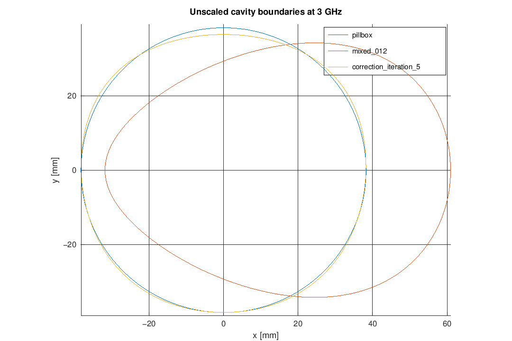
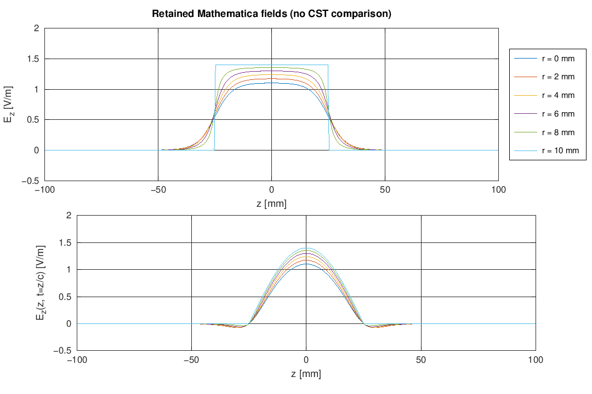
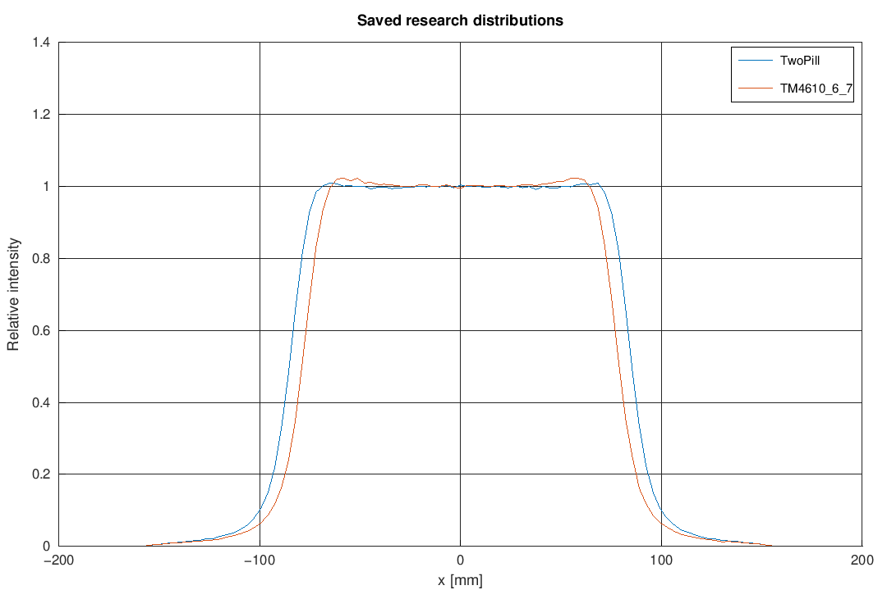

# Example gallery

These figures are generated by `tools/render_gallery.m`. They demonstrate what remains runnable and distinguish new computation from retained results. None is a fresh reproduction of the complete CST/RF-Track paper simulations.

## Freshly computed boundaries

Maintained shape solver: pillbox, equal mixed m=0/1/2, and iteration-5 correction. Residuals and the saved mixed-mode boundary are checked numerically.

## Retained field profiles

Replots compact Mathematica numerical outputs; no new Mathematica integration or CST overlay. Stored normalisation is retained.

## Retained distributions

Replots saved histogram files; does not rerun particle tracking or establish which later experimental settings generated every saved file.
